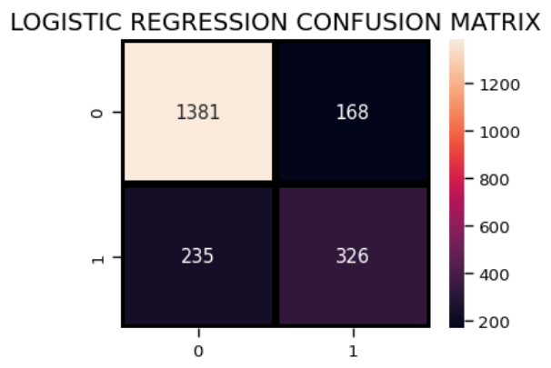
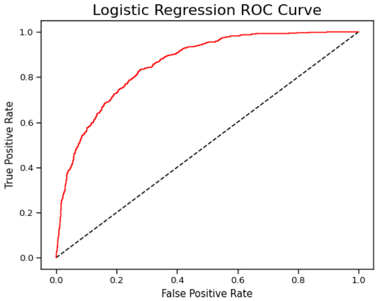
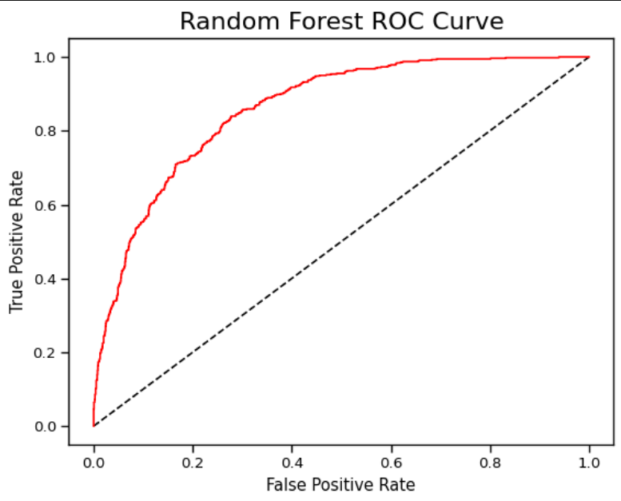
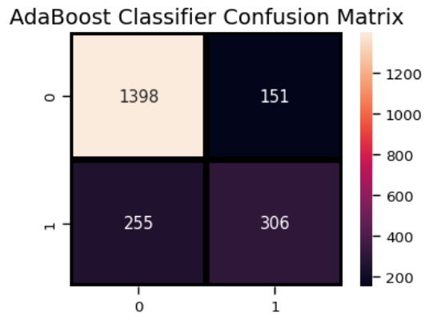

# Customer Churn Prediction

This project involves predicting customer churn for a telecom company using various machine learning models. The dataset includes customer demographics, service usage data, and billing information.

---

## 📦 Dependencies

Install the required Python libraries using pip:

```bash
pip install pandas numpy matplotlib seaborn scikit-learn xgboost
```

---

## 📖 Project Overview

### 1. Introduction
Understanding the reasons why customers leave a service is crucial. This project builds a machine learning pipeline to predict churn.

### 2. Loading Libraries & Data
We begin by importing necessary libraries and loading the CSV dataset into a Pandas DataFrame.

### 3. Understanding Data
A preliminary look into column types, null values, and data structure.

### 4. Visualizing Missing Data
We use `seaborn` and `missingno` (optional) to identify any missing or null values.

### 5. Data Manipulation
Converting categorical values, encoding binary features, dealing with numerical conversions and outliers.

### 6. Data Visualization
Exploring distributions, churn correlations, and key feature importance with plots.

### 7. Data Preprocessing
- Encoding categorical variables
- Feature scaling
- Train-test split

### 8. Model Building & Evaluation
We evaluate several models using confusion matrices, accuracy scores, and ROC curves:

#### 🔍 Logistic Regression



#### 🌲 Random Forest



#### ⚡ AdaBoost Classifier


#### 🌟 Gradient Boosting Classifier


#### ✅ Final Combined Evaluation


---

## 📁 Dataset Features

| Feature | Description |
|---------|-------------|
| customerID | Unique customer identifier |
| gender | Male/Female |
| SeniorCitizen | 1 if customer is senior |
| Partner | Has a partner |
| Dependents | Has dependents |
| tenure | Months with the company |
| PhoneService | Has phone service |
| MultipleLines | Has multiple phone lines |
| InternetService | Type of internet |
| OnlineSecurity | Has online security |
| OnlineBackup | Has online backup |
| DeviceProtection | Has device protection |
| TechSupport | Has tech support |
| StreamingTV | Uses streaming TV |
| StreamingMovies | Uses streaming movies |
| Contract | Type of contract |
| PaperlessBilling | Billing method |
| PaymentMethod | Mode of payment |
| MonthlyCharges | Monthly billing amount |
| TotalCharges | Total amount billed |
| Churn | Target variable (Yes/No) |

---

## ✅ Results

Among the evaluated models, **Gradient Boosting** and **Random Forest** performed best, showing high accuracy and better classification performance for churned customers.

---

## 🧠 Conclusion

This end-to-end churn prediction pipeline gives valuable insights into customer behavior and allows proactive retention strategies.

---

